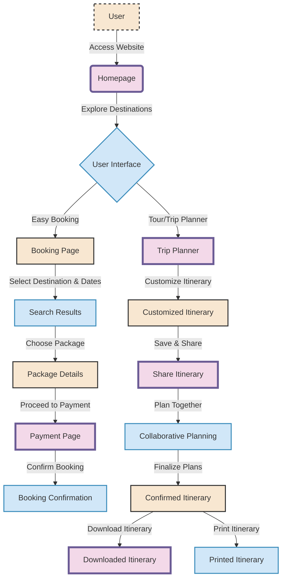

# TRAVEL AND TOURISM
This repository hosts the source code for a website developed using HTML, CSS, and JavaScript. The website aims to provide users with a seamless and user-friendly experience for booking and managing railway reservations.

