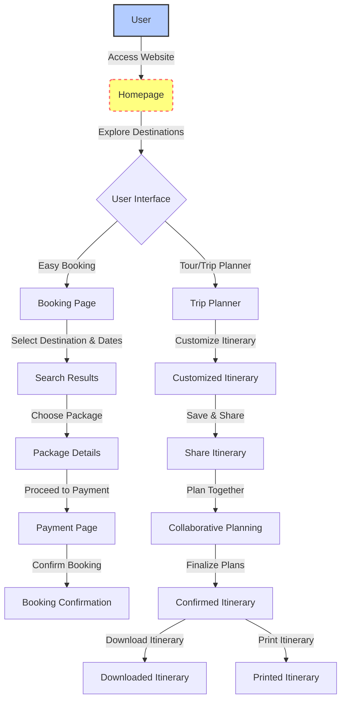

# Travel And Tourism Website
<b> CBP33 Travel and Tourism </b>  
Problem Statement: A solution/idea that can boost the current situation of the tourism industries including hotels, travel and others. 

This repository hosts the source code for a Railway Reservation website developed using HTML, CSS, and JavaScript. The website aims to provide users with a seamless and user-friendly experience for booking and managing railway reservations

