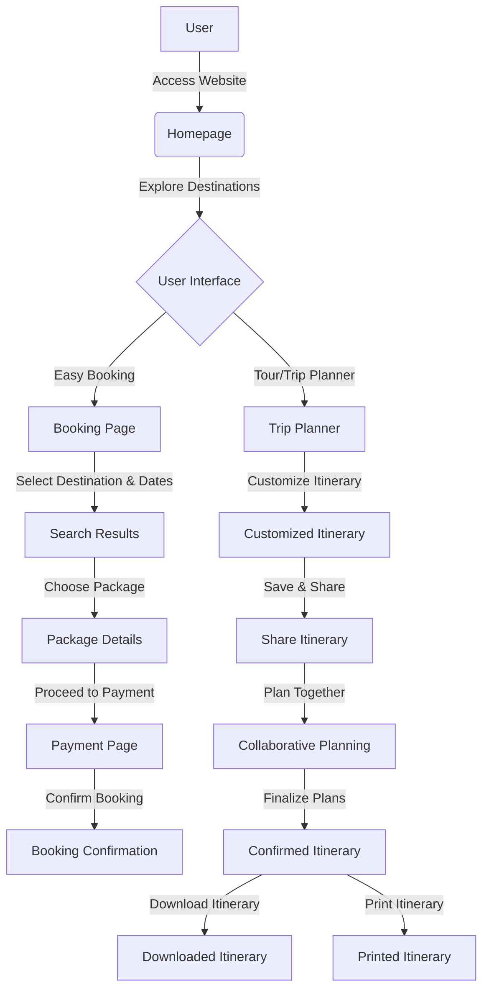

# Railway-Reservation-Website
This repository hosts the source code for a Railway Reservation website developed using HTML, CSS, and JavaScript. The website aims to provide users with a seamless and user-friendly experience for booking and managing railway reservations

